<!--
  RAKESH SURAMPALLI - GITHUB PROFILE
  Every image below is generated from the scripts in ./scripts.
  Edit the data at the top of those scripts, then run:
      python scripts/generate_profile_assets.py
  Do not hand-edit the SVGs in ./assets - they are build output.

  Two GitHub rendering rules shape the markup below:
  1. an image that is not already inside a link gets auto-wrapped in a link to
     its raw blob, opened in a new tab - so every image here carries its own
     same-page anchor instead;
  2. target="_blank" is stripped from author-supplied anchors, so external
     links open in the same tab (ctrl/cmd+click still opens a new one).
-->

<div align="center">

<a href="#about"></a>

<br><br>

<a href="#about"></a>
<a href="#projects"></a>
<a href="#architecture"></a>
<a href="#stack"></a>
<a href="#focus"></a>
<a href="#activity"></a>
<a href="#connect"></a>

<br><br>

<a href="https://www.linkedin.com/in/rakeshsurampalli27/"></a>
<a href="https://rakeshsurampalli.github.io/Rakesh_portfolio/"></a>
<a href="https://medium.com/@rakeshsurampalli"></a>
<a href="mailto:rakeshsurampalli@gmail.com"></a>

</div>

<br>

## ABOUT

<a href="#about"></a>

Full-Stack AI Engineer focused on building production-grade AI applications across
generative AI, agentic systems, retrieval, backend engineering, modern web platforms
and cloud infrastructure.

I work across the complete engineering lifecycle — translating ambiguous problems into
architecture, AI workflows, APIs, product experiences and production cloud systems.

My focus is not simply connecting software to an LLM.

I build systems where AI becomes part of a reliable product, workflow or decision process.

<a href="#about"></a>

<br>

## PROJECTS

<a href="#projects"></a>

<br>

## ARCHITECTURE

<a href="#architecture"></a>

<br>

## STACK

<a href="#stack"></a>

<br>

## FOCUS

<a href="#focus"></a>

<a href="#focus"></a>

<br>

## ACTIVITY

<a href="#activity"></a>

<br>

## CONNECT

<a href="#connect"></a>

<div align="center">

<a href="https://www.linkedin.com/in/rakeshsurampalli27/"></a>
<a href="https://rakeshsurampalli.github.io/Rakesh_portfolio/"></a>
<a href="https://medium.com/@rakeshsurampalli"></a>
<a href="mailto:rakeshsurampalli@gmail.com"></a>

</div>

<br>

<details>
<summary><sub><b>BUILD / REGENERATE THIS PROFILE</b></sub></summary>

<br>

Everything visible above is a generated SVG. Content lives in the scripts, not in the
markup — edit the data block at the top of a generator and rebuild.

```bash
python -m venv .venv
.venv\Scripts\activate          # Windows
source .venv/bin/activate       # macOS / Linux

pip install -r requirements.txt

python scripts/generate_profile_assets.py   # all static assets, offline
python scripts/fetch_contributions.py       # activity stream (needs network)
```

| path | what it builds |
| --- | --- |
| `scripts/theme.py` | palette, typography and the shared SVG primitives |
| `scripts/make_ascii_portrait.py` | `assets/ascii-portrait.svg` from `assets/profile-photo.jpg` |
| `scripts/generate_hero.py` | `assets/hero-terminal.svg` |
| `scripts/generate_sections.py` | about / projects / stack / focus / philosophy / connect |
| `scripts/generate_architecture.py` | `assets/architecture.svg` |
| `scripts/generate_buttons.py` | navigation and social buttons |
| `scripts/fetch_contributions.py` | `assets/contributions.json` from public GitHub data |
| `scripts/generate_heatmap.py` | `assets/contribution-stream.svg` from that cache |

**Replacing the portrait.** Drop a new photograph at `assets/profile-photo.jpg` and run
`python scripts/make_ascii_portrait.py && python scripts/generate_hero.py`. Framing and
tone are controlled by the constants at the top of `make_ascii_portrait.py`
(`CROP`, `ASCII_WIDTH`, `CONTRAST`, `GAMMA`, `FLOOR`, `FADE_BOTTOM`). With no photograph
present, both assets render a labelled placeholder instead.

**Activity.** `.github/workflows/update-profile.yml` runs daily at 05:17 UTC, re-fetches
the public contribution calendar and commits only when the generated SVG actually
changed. A failed fetch leaves the previous asset in place rather than blanking it.

</details>

<div align="center">
<sub>generated with python · no javascript · no third-party stat cards</sub>
</div>
