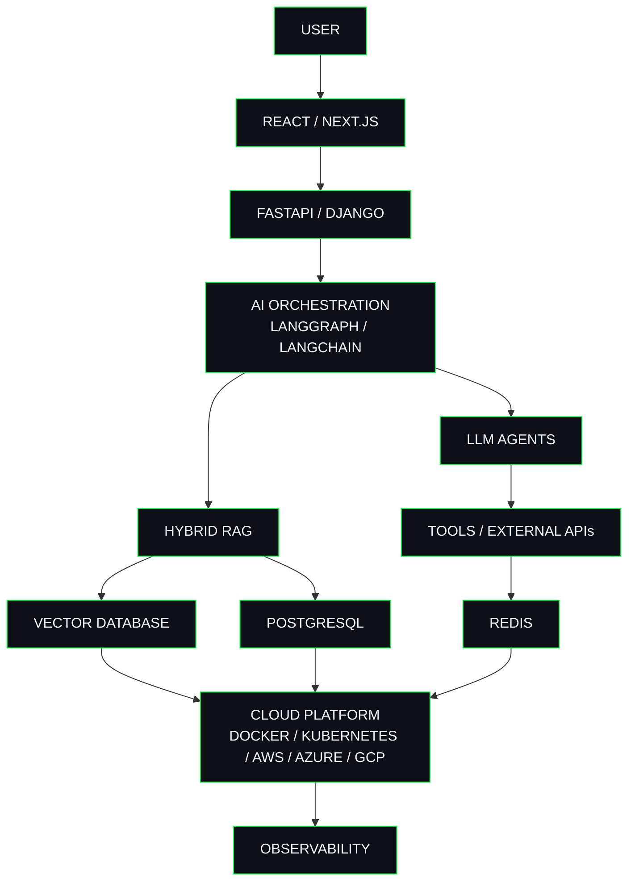

<!-- ============================================================
     RAKESH SURAMPALLI
     GITHUB PROFILE README
     MATRIX EDITION
     ============================================================ -->

<h1>RAKESH SURAMPALLI</h1>

<h3>FULL-STACK AI ENGINEER · AI PRODUCT BUILDER</h3>

Building production-grade AI systems across Generative AI, Agentic Systems,
Hybrid RAG, Full-Stack Engineering and Cloud.

 

  

---

---

# 01 / ABOUT

## Full-Stack AI Engineer building intelligent systems from idea to production.

I build **production-grade AI applications** spanning Generative AI, agentic systems, Retrieval-Augmented Generation, backend engineering, modern web platforms and cloud infrastructure.

My work sits at the intersection of **Artificial Intelligence, Software Engineering, Product Thinking and Cloud Architecture**.

I enjoy taking an ambiguous problem and turning it into a system that can **understand context, retrieve information, reason, use tools, execute workflows and continuously improve**.

The goal is not simply to connect an application to an LLM.

The goal is to engineer **reliable AI-powered products that solve real problems**.

 

<table>
<tr>

<td width="25%" align="center">

<h3>AI SYSTEMS</h3>

LLMs 
Agentic AI 
Hybrid RAG 
LangGraph 
LangChain 
AI Evaluation

</td>

<td width="25%" align="center">

<h3>BACKEND</h3>

Python 
FastAPI 
Django 
REST APIs 
PostgreSQL 
System Design

</td>

<td width="25%" align="center">

<h3>PRODUCT</h3>

React 
JavaScript 
TypeScript 
Responsive UI 
API Integration 
Product Engineering

</td>

<td width="25%" align="center">

<h3>PLATFORM</h3>

AWS 
Azure 
Google Cloud 
Docker 
Kubernetes 
CI/CD

</td>

</tr>
</table>

---

# 02 / HOW I BUILD

I treat AI applications as **complete software systems**, not isolated model integrations.

 

<table>

<tr>

<td width="16%" align="center">

<h3>01</h3>

<strong>UNDERSTAND</strong>

  

User problem 
Business need 
Constraints 
Success metrics

</td>

<td width="16%" align="center">

<h3>02</h3>

<strong>ARCHITECT</strong>

  

Product 
AI 
Data 
Cloud

</td>

<td width="16%" align="center">

<h3>03</h3>

<strong>BUILD</strong>

  

Agents 
RAG 
APIs 
Frontend

</td>

<td width="16%" align="center">

<h3>04</h3>

<strong>DEPLOY</strong>

  

Docker 
Kubernetes 
CI/CD 
Cloud

</td>

<td width="16%" align="center">

<h3>05</h3>

<strong>OBSERVE</strong>

  

Logs 
Latency 
Quality 
Reliability

</td>

<td width="16%" align="center">

<h3>06</h3>

<strong>IMPROVE</strong>

  

Feedback 
Evaluation 
Optimization 
Iteration

</td>

</tr>

</table>

 

### SYSTEM FLOW

---

# 03 / PRODUCTS

<table>

<tr>

<td width="33%" valign="top">

<h2 align="center">FinAI</h2>

<strong>AI Financial Intelligence Platform</strong>

AI-powered platform designed to transform financial, company, portfolio, market and news data into actionable intelligence.

 

<strong>CORE CAPABILITIES</strong>

  

• Portfolio intelligence 
• Fundamental analysis 
• Technical analysis 
• AI-generated insights 
• Risk scoring 
• News intelligence 
• Sentiment analysis 
• Stock forecasting 
• S&P 500 benchmarking 
• Financial visualization

  

<strong>ENGINEERING</strong>

  

Python · Django · React · PostgreSQL · LLMs · APIs · Docker · Cloud

</td>

<td width="33%" valign="top">

<h2 align="center">Tudu</h2>

<strong>AI Productivity & Planning Platform</strong>

An intelligent productivity platform that understands natural-language tasks and transforms them into contextual, structured and actionable plans.

 

<strong>CORE CAPABILITIES</strong>

  

• Natural-language tasks 
• Intelligent date extraction 
• Smart scheduling 
• AI recommendations 
• Context-aware planning 
• Location intelligence 
• Nearby store discovery 
• Shared task workflows 
• Authentication 
• Mobile-first architecture

  

<strong>ENGINEERING</strong>

  

AI Agents · React · Django · PostgreSQL · REST APIs · Maps · JWT · Cloud

</td>

<td width="33%" valign="top">

<h2 align="center">Atharva</h2>

<strong>AI + IoT Agricultural Intelligence</strong>

An intelligent agriculture ecosystem combining AI, connected devices, analytics, automation and digital market infrastructure.

 

<strong>CORE CAPABILITIES</strong>

  

• Crop intelligence 
• Soil analysis 
• IoT monitoring 
• Smart irrigation 
• Crop-health analysis 
• Pest detection 
• Weather intelligence 
• Farmer marketplace 
• Recommendations 
• Agricultural analytics

  

<strong>ENGINEERING</strong>

  

Artificial Intelligence · IoT · Cloud · APIs · Analytics · Automation

</td>

</tr>

</table>

---

# 04 / AI ENGINEERING

 

## REFERENCE AI SYSTEM ARCHITECTURE

 

<table>

<tr>

<td width="25%" valign="top">

<h3>GENERATIVE AI</h3>

Prompt Engineering 
Context Engineering 
Structured Output 
Function Calling 
LLM APIs 
Model Selection 
Evaluation 
Guardrails

</td>

<td width="25%" valign="top">

<h3>AGENTIC SYSTEMS</h3>

LangGraph 
Stateful Agents 
Tool Calling 
Workflow Routing 
Agent Memory 
Human-in-the-Loop 
Multi-Step Workflows 
Agent Monitoring

</td>

<td width="25%" valign="top">

<h3>RETRIEVAL</h3>

Hybrid RAG 
Semantic Search 
Keyword Search 
Embeddings 
Vector Search 
Chunking 
Reranking 
Retrieval Evaluation

</td>

<td width="25%" valign="top">

<h3>AI SECURITY</h3>

Prompt Injection Defense 
Input Validation 
Output Validation 
Guardrails 
Monitoring 
Access Control 
Data Protection 
Trustworthy AI

</td>

</tr>

</table>

---

# 05 / TECHNOLOGY STACK

## AI / GENERATIVE AI

 

## LANGUAGES

 

## BACKEND / APIs

 

## FRONTEND

 

## DATABASES / STORAGE

 

## MACHINE LEARNING / DATA

 

## CLOUD

 

## DEVOPS / INFRASTRUCTURE

 

## SECURITY / OBSERVABILITY

 

## ANALYTICS / VISUALIZATION

 

## DEVELOPMENT TOOLS

---

# 06 / CURRENT FOCUS

<table>

<tr>

<td width="33%" valign="top">

<h3>AI ENGINEERING</h3>

<strong>Generative AI</strong> 
Production LLM Applications 
Context Engineering 
Structured Generation 
Tool Calling 
LLM Evaluation 
Guardrails

  

<strong>Agentic Systems</strong> 
LangGraph 
Stateful Workflows 
Tool-Using Agents 
Human-in-the-Loop 
Agent Monitoring

</td>

<td width="33%" valign="top">

<h3>RETRIEVAL & SECURITY</h3>

<strong>Retrieval</strong> 
Hybrid RAG 
Semantic Search 
Keyword Search 
Vector Retrieval 
Reranking 
Retrieval Evaluation

  

<strong>AI Security</strong> 
Prompt Injection Defense 
Input Validation 
Output Validation 
AI Monitoring 
Application Security

</td>

<td width="33%" valign="top">

<h3>PLATFORM ENGINEERING</h3>

<strong>Backend</strong> 
API Architecture 
Distributed Systems 
Authentication 
Authorization 
Database Design 
Async Processing

  

<strong>Cloud</strong> 
Containers 
Kubernetes 
CI/CD 
Cloud-Native Architecture 
Production Monitoring

</td>

</tr>

</table>

---

# ENGINEERING PRINCIPLES

<table>

<tr>

<td width="25%" align="center">

<h3>01 / SOLVE</h3>

Understand the actual problem before selecting the technology.

</td>

<td width="25%" align="center">

<h3>02 / DESIGN</h3>

Treat AI as one component of a complete production system.

</td>

<td width="25%" align="center">

<h3>03 / MEASURE</h3>

Measure quality, latency, reliability, security and user impact.

</td>

<td width="25%" align="center">

<h3>04 / IMPROVE</h3>

Use production feedback to continuously improve the system.

</td>

</tr>

</table>

 

> **AI becomes valuable when it moves beyond a model response and becomes part of a reliable product, workflow or decision system.**

---

# 07 / GITHUB ACTIVITY

No external statistics dashboards or broken activity images.

GitHub already provides the native contribution graph, repository history and activity directly on the profile.

 

---

# 08 / CONNECT

<h3>BUILDING INTELLIGENT SYSTEMS THAT SOLVE REAL PROBLEMS</h3>

Generative AI · Agentic Systems · Hybrid RAG · Full-Stack AI · AI SaaS

Cloud Architecture · Intelligent Automation · AI Security · Product Engineering

  

  

<strong>BUILD SYSTEMS · SOLVE PROBLEMS · CREATE IMPACT</strong>

  

