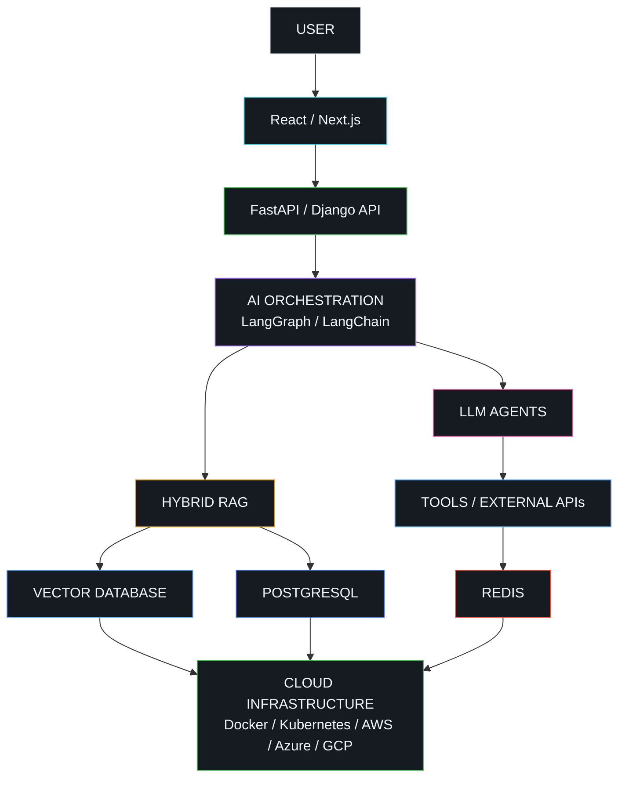

<!-- ==========================================================
     RAKESH SURAMPALLI
     GITHUB PROFILE README
     ========================================================== -->

<div align="center">


<br/><br/>

<a href="https://www.linkedin.com/in/rakeshsurampalli27/">

</a>

<a href="https://rakeshsurampalli.github.io/Rakesh_portfolio/">

</a>

<a href="https://medium.com/@rakeshsurampalli">

</a>

<a href="mailto:rakeshsurampalli@gmail.com">

</a>

<br/><br/>


</div>

---

<div align="center">

[ABOUT](#01--about) •
[HOW I BUILD](#02--how-i-build) •
[PRODUCTS](#03--products) •
[AI ENGINEERING](#04--ai-engineering) •
[STACK](#05--technology-stack) •
[FOCUS](#06--current-focus) •
[ACTIVITY](#07--github-activity) •
[CONNECT](#08--connect)

</div>

---

# 01 / ABOUT

### Full-Stack AI Engineer building intelligent systems from idea to production.

I build **production-grade AI applications** across Generative AI, agentic systems, Retrieval-Augmented Generation, backend engineering, modern web applications and cloud infrastructure.

My work sits at the intersection of:

```text
ARTIFICIAL INTELLIGENCE
          +
SOFTWARE ENGINEERING
          +
PRODUCT THINKING
          +
CLOUD INFRASTRUCTURE
```

I enjoy taking ambiguous problems and converting them into complete systems that can:

```text
UNDERSTAND  →  RETRIEVE  →  REASON  →  USE TOOLS  →  ACT  →  IMPROVE
```

My focus is not simply connecting an application to an LLM.

I focus on engineering systems where **AI becomes part of a reliable product, workflow or decision process**.

<br/>

<table>
<tr>

<td width="25%" align="center">

### AI SYSTEMS

`LLMs`

`Agentic AI`

`Hybrid RAG`

`LangGraph`

`LangChain`

`AI Evaluation`

</td>

<td width="25%" align="center">

### BACKEND

`Python`

`FastAPI`

`Django`

`REST APIs`

`PostgreSQL`

`System Design`

</td>

<td width="25%" align="center">

### PRODUCT

`React`

`JavaScript`

`TypeScript`

`Responsive UI`

`API Integration`

`Product Engineering`

</td>

<td width="25%" align="center">

### PLATFORM

`AWS`

`Azure`

`GCP`

`Docker`

`Kubernetes`

`CI/CD`

</td>

</tr>
</table>

---

<div align="center">

<pre>
              │
              │
           .-----.
         .'       '.
        /  o     o  \
       |      ^      |
       |    \___/    |
        \           /
         '---------'
            /|\
           / | \
             │
             │
             ▼
</pre>

<sub>KEEP SCROLLING</sub>

</div>

---

# 02 / HOW I BUILD

I approach AI products as **complete engineering systems**, not isolated model integrations.


### SYSTEM DEVELOPMENT FLOW

```text
01 / UNDERSTAND
     │
     ├── User Problem
     ├── Business Requirements
     ├── Constraints
     └── Success Metrics
     │
     ▼

02 / ARCHITECT
     │
     ├── Product Architecture
     ├── AI Architecture
     ├── Data Architecture
     └── Cloud Architecture
     │
     ▼

03 / BUILD
     │
     ├── Agents
     ├── RAG Pipelines
     ├── APIs
     ├── Databases
     └── Frontend
     │
     ▼

04 / DEPLOY
     │
     ├── Docker
     ├── Kubernetes
     ├── CI/CD
     └── Cloud
     │
     ▼

05 / OBSERVE
     │
     ├── Logs
     ├── Metrics
     ├── AI Quality
     ├── Latency
     └── Reliability
     │
     ▼

06 / IMPROVE
     │
     └── Production Feedback → Better System
```

---

# 03 / PRODUCTS

<table>
<tr>

<td width="33%" valign="top">

<h2 align="center">FinAI</h2>

<p align="center"><strong>AI Financial Intelligence Platform</strong></p>

AI-powered financial intelligence platform designed to transform portfolio, company, market and news data into useful investment insights.

<br/>

<strong>CORE SYSTEMS</strong>

<br/><br/>

`Portfolio Intelligence`

`Fundamental Analysis`

`Technical Analysis`

`Risk Scoring`

`AI Insights`

`News Intelligence`

`Sentiment Analysis`

`Stock Forecasting`

`S&P 500 Benchmarking`

<br/><br/>

<strong>ENGINEERING</strong>

<br/><br/>

`Python`

`Django`

`React`

`PostgreSQL`

`LLMs`

`Financial APIs`

`Docker`

`Cloud`

</td>

<td width="33%" valign="top">

<h2 align="center">Tudu</h2>

<p align="center"><strong>AI Productivity & Planning Platform</strong></p>

An intelligent productivity platform that understands natural-language tasks and transforms them into structured, contextual and actionable plans.

<br/>

<strong>CORE SYSTEMS</strong>

<br/><br/>

`Task Intelligence`

`Natural Language Input`

`Smart Scheduling`

`Date Extraction`

`AI Recommendations`

`Location Intelligence`

`Shared Tasks`

`Authentication`

`Planning Workflows`

<br/><br/>

<strong>ENGINEERING</strong>

<br/><br/>

`AI Agents`

`React`

`Django`

`PostgreSQL`

`REST APIs`

`Maps`

`JWT`

`Cloud`

</td>

<td width="33%" valign="top">

<h2 align="center">Atharva</h2>

<p align="center"><strong>AI + IoT Agricultural Intelligence</strong></p>

An intelligent agriculture ecosystem combining artificial intelligence, connected devices, analytics and digital market infrastructure.

<br/>

<strong>CORE SYSTEMS</strong>

<br/><br/>

`Crop Intelligence`

`Soil Analysis`

`IoT Monitoring`

`Smart Irrigation`

`Crop Health`

`Pest Detection`

`Weather Intelligence`

`Farmer Marketplace`

`Recommendations`

<br/><br/>

<strong>ENGINEERING</strong>

<br/><br/>

`AI`

`IoT`

`Cloud`

`Analytics`

`Automation`

`APIs`

</td>

</tr>
</table>

---

<div align="center">

<pre>
              │
              │
          .---------.
        .'           '.
       /   ◉       ◉   \
      |        ^        |
      |      _____      |
       \               /
        '-------------'
            / | \
           /  |  \
              │
              ▼
</pre>

<sub>MORE SYSTEMS BELOW</sub>

</div>

---

# 04 / AI ENGINEERING

<div align="center">


</div>

<br/>

## REFERENCE AI ARCHITECTURE



<br/>

<table>
<tr>

<td width="33%" valign="top">

### GENERATIVE AI

`Prompt Engineering`

`Context Engineering`

`Structured Output`

`Function Calling`

`LLM APIs`

`Model Selection`

`AI Evaluation`

`Guardrails`

</td>

<td width="33%" valign="top">

### AGENTIC SYSTEMS

`LangGraph`

`Stateful Agents`

`Tool Calling`

`Workflow Routing`

`Agent Memory`

`Human-in-the-Loop`

`Multi-Step Workflows`

`Agent Monitoring`

</td>

<td width="33%" valign="top">

### RETRIEVAL

`Hybrid RAG`

`Semantic Search`

`Keyword Search`

`Embeddings`

`Vector Search`

`Chunking`

`Reranking`

`Retrieval Evaluation`

</td>

</tr>
</table>

---

# 05 / TECHNOLOGY STACK

## AI / GENERATIVE AI

<div align="center">


</div>

<br/>

## LANGUAGES

<div align="center">


</div>

<br/>

## BACKEND / APIs

<div align="center">


</div>

<br/>

## FRONTEND

<div align="center">


</div>

<br/>

## DATABASES / STORAGE

<div align="center">


</div>

<br/>

## MACHINE LEARNING / DATA

<div align="center">


</div>

<br/>

## CLOUD

<div align="center">


</div>

<br/>

## DEVOPS / INFRASTRUCTURE

<div align="center">


</div>

<br/>

## SECURITY / OBSERVABILITY

<div align="center">


</div>

<br/>

## ANALYTICS / VISUALIZATION

<div align="center">


</div>

<br/>

## DEVELOPMENT TOOLS

<div align="center">


</div>

---

# 06 / CURRENT FOCUS

```yaml
AI_ENGINEERING:

  Generative_AI:
    - Production LLM Applications
    - Context Engineering
    - Structured Generation
    - Tool Calling
    - AI Evaluation

  Agentic_Systems:
    - LangGraph
    - Stateful Agents
    - Multi-Step Workflows
    - Tool-Using Agents
    - Human-in-the-Loop
    - Agent Monitoring

  Retrieval:
    - Hybrid RAG
    - Semantic Search
    - Keyword Search
    - Vector Retrieval
    - Reranking
    - Retrieval Evaluation

  AI_Security:
    - Prompt Injection Defense
    - Input Validation
    - Output Validation
    - AI Monitoring
    - Application Security
    - Trustworthy AI


SOFTWARE_ENGINEERING:

  Backend:
    - API Architecture
    - Distributed Systems
    - Authentication
    - Authorization
    - Database Design
    - Async Processing

  Cloud:
    - Docker
    - Kubernetes
    - CI/CD
    - Cloud-Native Systems
    - Production Monitoring

  Product:
    - AI SaaS
    - Intelligent Automation
    - Human-AI Collaboration
    - Full-Stack AI Products
```

---

# ENGINEERING PRINCIPLES

<table>
<tr>

<td width="25%" align="center">

### 01

**SOLVE**

Understand the real problem before choosing the technology.

</td>

<td width="25%" align="center">

### 02

**DESIGN**

Treat AI as one component of a complete software system.

</td>

<td width="25%" align="center">

### 03

**MEASURE**

Evaluate quality, latency, reliability and user impact.

</td>

<td width="25%" align="center">

### 04

**IMPROVE**

Use production feedback to continuously improve the system.

</td>

</tr>
</table>

<br/>

> **AI becomes valuable when it moves beyond a model response and becomes part of a reliable product, workflow or decision system.**

---

<div align="center">

<pre>
              │
              │
          .---------.
        .'           '.
       /    o     o    \
      |        ^        |
      |      _____      |
       \               /
        '-------------'
          __/  |  \__
              │
              │
              ▼
</pre>

<sub>ALMOST THERE</sub>

</div>

---

# 07 / GITHUB ACTIVITY

<div align="center">


</div>

<br/>

<div align="center">


</div>

<br/>

<div align="center">


</div>

---

# 08 / CONNECT

<div align="center">

### Let's build intelligent systems that solve real problems.

<br/>

`GENERATIVE AI`
&nbsp;
`AI AGENTS`
&nbsp;
`RAG`
&nbsp;
`FULL-STACK AI`

<br/><br/>

`AI SAAS`
&nbsp;
`CLOUD ARCHITECTURE`
&nbsp;
`INTELLIGENT AUTOMATION`
&nbsp;
`AI SECURITY`

<br/><br/>

<a href="https://www.linkedin.com/in/rakeshsurampalli27/">

</a>

<a href="mailto:rakeshsurampalli@gmail.com">

</a>

<a href="https://rakeshsurampalli.github.io/Rakesh_portfolio/">

</a>

<a href="https://medium.com/@rakeshsurampalli">

</a>

<br/><br/><br/>

<pre>
BUILD SYSTEMS  /  SOLVE PROBLEMS  /  CREATE IMPACT
</pre>

<br/>


</div>
